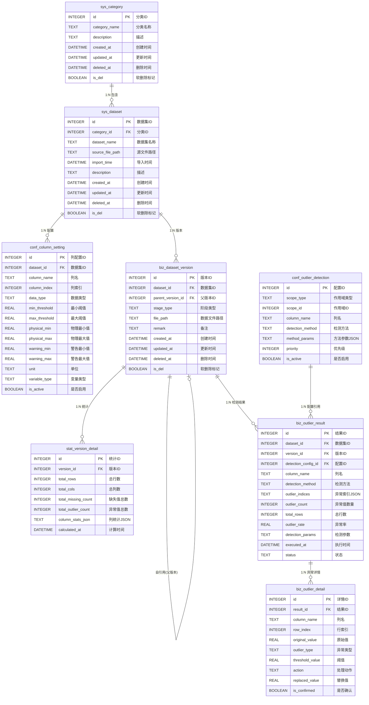

# 数据库设计文档

## 1. 概述

本项目采用 **SQLite** 作为本地数据库，使用 `better-sqlite3` 作为 Node.js 驱动。数据库采用混合存储架构：

- **SQLite**：存储元数据、配置信息、统计数据
- **文件系统**：存储实际的数据文件（Parquet 格式）

### 1.1 技术栈

- **数据库引擎**：SQLite 3
- **Node.js 驱动**：better-sqlite3
- **日志模式**：WAL (Write-Ahead Logging)

### 1.2 表命名规范

| 前缀    | 含义       | 示例                                            |
| ------- | ---------- | ----------------------------------------------- |
| `sys_`  | 系统基础表 | `sys_category`, `sys_dataset`                   |
| `conf_` | 配置表     | `conf_column_setting`, `conf_outlier_detection` |
| `biz_`  | 业务数据表 | `biz_dataset_version`, `biz_outlier_result`     |
| `stat_` | 统计数据表 | `stat_version_detail`                           |

---

## 2. ER 图



---

## 3. 数据表详细设计

### 3.1 sys_category（分类表）

存储数据集分类的基本信息。

| 字段名          | 类型     | 约束                      | 默认值            | 说明                           |
| --------------- | -------- | ------------------------- | ----------------- | ------------------------------ |
| `id`            | INTEGER  | PRIMARY KEY AUTOINCREMENT | -                 | 分类唯一标识                   |
| `category_name` | TEXT     | NOT NULL                  | -                 | 分类名称                       |
| `description`   | TEXT     | -                         | NULL              | 分类描述                       |
| `created_at`    | DATETIME | -                         | CURRENT_TIMESTAMP | 创建时间                       |
| `updated_at`    | DATETIME | -                         | CURRENT_TIMESTAMP | 更新时间                       |
| `deleted_at`    | DATETIME | -                         | NULL              | 删除时间                       |
| `is_del`        | BOOLEAN  | -                         | 0                 | 软删除标记（0=正常，1=已删除） |

**业务说明**：

- 分类是系统的顶层管理单元，用于对数据集进行分组归类
- 分类仅需名称，无需其他属性

---

### 3.2 sys_dataset（数据集表）

存储导入的数据集基本信息。

| 字段名             | 类型     | 约束                      | 默认值            | 说明                       |
| ------------------ | -------- | ------------------------- | ----------------- | -------------------------- |
| `id`               | INTEGER  | PRIMARY KEY AUTOINCREMENT | -                 | 数据集唯一标识             |
| `category_id`      | INTEGER  | NOT NULL, FK              | -                 | 所属分类ID                 |
| `dataset_name`     | TEXT     | NOT NULL                  | -                 | 数据集名称（通常为文件名） |
| `source_file_path` | TEXT     | -                         | NULL              | 原始文件路径               |
| `import_time`      | DATETIME | -                         | CURRENT_TIMESTAMP | 导入时间                   |
| `description`      | TEXT     | -                         | NULL              | 数据集描述                 |
| `created_at`       | DATETIME | -                         | CURRENT_TIMESTAMP | 创建时间                   |
| `updated_at`       | DATETIME | -                         | CURRENT_TIMESTAMP | 更新时间                   |
| `deleted_at`       | DATETIME | -                         | NULL              | 删除时间                   |
| `is_del`           | BOOLEAN  | -                         | 0                 | 软删除标记                 |

**外键关系**：

- `category_id` → `sys_category.id`（级联删除）

**业务说明**：

- 数据集是数据分析的基本单元，通常对应一个导入的 CSV 文件
- 一个分类可以包含多个数据集

---

### 3.3 conf_column_setting（列配置表）

存储数据集中每列的配置信息和质控阈值。

| 字段名          | 类型     | 约束                      | 默认值            | 说明                                  |
| --------------- | -------- | ------------------------- | ----------------- | ------------------------------------- |
| `id`            | INTEGER  | PRIMARY KEY AUTOINCREMENT | -                 | 配置唯一标识                          |
| `dataset_id`    | INTEGER  | NOT NULL, FK              | -                 | 所属数据集ID                          |
| `column_name`   | TEXT     | NOT NULL                  | -                 | 列名                                  |
| `column_index`  | INTEGER  | -                         | NULL              | 列在文件中的顺序（0开始）             |
| `data_type`     | TEXT     | -                         | NULL              | 数据类型（number/string/datetime）    |
| `min_threshold` | REAL     | -                         | NULL              | 基础最小阈值                          |
| `max_threshold` | REAL     | -                         | NULL              | 基础最大阈值                          |
| `physical_min`  | REAL     | -                         | NULL              | 物理最小值（绝对边界）                |
| `physical_max`  | REAL     | -                         | NULL              | 物理最大值（绝对边界）                |
| `warning_min`   | REAL     | -                         | NULL              | 警告最小值（软边界）                  |
| `warning_max`   | REAL     | -                         | NULL              | 警告最大值（软边界）                  |
| `unit`          | TEXT     | -                         | NULL              | 单位（如 °C, W/m², μmol/m²/s）        |
| `variable_type` | TEXT     | -                         | NULL              | 变量类型（如 temperature, radiation） |
| `is_active`     | BOOLEAN  | -                         | 1                 | 是否参与计算                          |
| `created_at`    | DATETIME | -                         | CURRENT_TIMESTAMP | 创建时间                              |
| `updated_at`    | DATETIME | -                         | CURRENT_TIMESTAMP | 更新时间                              |
| `deleted_at`    | DATETIME | -                         | NULL              | 删除时间                              |
| `is_del`        | BOOLEAN  | -                         | 0                 | 软删除标记                            |

**外键关系**：

- `dataset_id` → `sys_dataset.id`（级联删除）

**阈值层级说明**：
| 阈值类型 | 字段 | 用途 |
|----------|------|------|
| 物理阈值 | `physical_min/max` | 绝对边界，超出即为无效数据 |
| 警告阈值 | `warning_min/max` | 软边界，超出需人工审核 |
| 基础阈值 | `min/max_threshold` | 通用阈值，用于简单过滤 |

---

### 3.4 biz_dataset_version（数据版本表）

存储数据集在不同处理阶段的版本快照。

| 字段名              | 类型         | 约束                      | 默认值            | 说明                        |
| ------------------- | ------------ | ------------------------- | ----------------- | --------------------------- |
| `id`                | INTEGER      | PRIMARY KEY AUTOINCREMENT | -                 | 版本唯一标识                |
| `dataset_id`        | INTEGER      | NOT NULL, FK              | -                 | 所属数据集ID                |
| `parent_version_id` | INTEGER      | FK                        | NULL              | 父版本ID（用于版本追溯）    |
| `stage_type`        | TEXT         | NOT NULL                  | -                 | 阶段类型                    |
| `file_path`         | VARCHAR(256) | NOT NULL                  | -                 | 数据文件路径（Parquet格式） |
| `remark`            | TEXT         | -                         | NULL              | 版本备注                    |
| `created_at`        | DATETIME     | -                         | CURRENT_TIMESTAMP | 创建时间                    |
| `updated_at`        | DATETIME     | -                         | CURRENT_TIMESTAMP | 更新时间                    |
| `deleted_at`        | DATETIME     | -                         | NULL              | 删除时间                    |
| `is_del`            | BOOLEAN      | -                         | 0                 | 软删除标记                  |

**外键关系**：

- `dataset_id` → `sys_dataset.id`（级联删除）
- `parent_version_id` → `biz_dataset_version.id`（自引用）

**阶段类型枚举**：
| 值 | 说明 |
|----|------|
| `RAW` | 原始数据（首次导入） |
| `FILTERED` | 异常值过滤后 |
| `QC` | 质量控制后 |

**业务说明**：

- 支持版本链追溯，通过 `parent_version_id` 可追溯数据处理历史
- 实际数据以 Parquet 格式存储在文件系统，数据库仅存储文件路径

---

### 3.5 stat_version_detail（统计详情表）

存储每个数据版本的统计指标。

| 字段名                | 类型     | 约束                      | 默认值            | 说明                     |
| --------------------- | -------- | ------------------------- | ----------------- | ------------------------ |
| `id`                  | INTEGER  | PRIMARY KEY AUTOINCREMENT | -                 | 统计记录唯一标识         |
| `version_id`          | INTEGER  | NOT NULL, FK              | -                 | 所属版本ID               |
| `total_rows`          | INTEGER  | -                         | 0                 | 总行数                   |
| `total_cols`          | INTEGER  | -                         | 0                 | 总列数                   |
| `total_missing_count` | INTEGER  | -                         | 0                 | 缺失值总数               |
| `total_outlier_count` | INTEGER  | -                         | 0                 | 异常值总数               |
| `column_stats_json`   | TEXT     | -                         | NULL              | 列级统计信息（JSON格式） |
| `calculated_at`       | DATETIME | -                         | CURRENT_TIMESTAMP | 计算时间                 |
| `created_at`          | DATETIME | -                         | CURRENT_TIMESTAMP | 创建时间                 |
| `updated_at`          | DATETIME | -                         | CURRENT_TIMESTAMP | 更新时间                 |
| `deleted_at`          | DATETIME | -                         | NULL              | 删除时间                 |
| `is_del`              | BOOLEAN  | -                         | 0                 | 软删除标记               |

**外键关系**：

- `version_id` → `biz_dataset_version.id`（级联删除）

**column_stats_json 结构示例**：

```json
{
  "Ta_2m": {
    "missing_count": 10,
    "outlier_count": 5,
    "min_val": -25.5,
    "max_val": 40.2,
    "mean_val": 15.3,
    "std_dev": 8.1
  },
  "SW_IN": {
    "missing_count": 0,
    "outlier_count": 120,
    "min_val": 0,
    "max_val": 1200,
    "mean_val": 350.7,
    "std_dev": 200.5
  }
}
```

---

### 3.6 conf_outlier_detection（异常检测配置表）

存储异常检测方法的配置，支持三级作用域。

| 字段名             | 类型     | 约束                      | 默认值            | 说明                         |
| ------------------ | -------- | ------------------------- | ----------------- | ---------------------------- |
| `id`               | INTEGER  | PRIMARY KEY AUTOINCREMENT | -                 | 配置唯一标识                 |
| `scope_type`       | TEXT     | NOT NULL, CHECK           | -                 | 作用域类型                   |
| `scope_id`         | INTEGER  | -                         | NULL              | 作用域ID（APP时为NULL）      |
| `column_name`      | TEXT     | -                         | NULL              | 列名（NULL表示全局默认）     |
| `detection_method` | TEXT     | NOT NULL                  | -                 | 检测方法标识                 |
| `method_params`    | TEXT     | -                         | NULL              | 方法参数（JSON格式）         |
| `priority`         | INTEGER  | -                         | 0                 | 优先级（数值越大优先级越高） |
| `is_active`        | BOOLEAN  | -                         | 1                 | 是否启用                     |
| `created_at`       | DATETIME | -                         | CURRENT_TIMESTAMP | 创建时间                     |
| `updated_at`       | DATETIME | -                         | CURRENT_TIMESTAMP | 更新时间                     |
| `deleted_at`       | DATETIME | -                         | NULL              | 删除时间                     |
| `is_del`           | BOOLEAN  | -                         | 0                 | 软删除标记                   |

**作用域类型枚举**：
| 值 | 说明 | scope_id 含义 |
|----|------|---------------|
| `APP` | 全局配置 | NULL |
| `CATEGORY` | 分类级配置 | sys_category.id |
| `DATASET` | 数据集级配置 | sys_dataset.id |

**检测方法枚举**：
| 方法ID | 名称 | 类别 | 说明 |
|--------|------|------|------|
| `THRESHOLD_STATIC` | 静态阈值 | threshold | 基于固定阈值过滤 |
| `THRESHOLD_DYNAMIC` | 动态阈值 | threshold | 基于统计量动态计算阈值 |
| `ZSCORE` | Z-Score | statistical | 基于标准差的异常检测 |
| `MODIFIED_ZSCORE` | Modified Z-Score | statistical | 基于MAD的鲁棒Z-Score |
| `IQR` | 四分位距 | statistical | 基于IQR的箱线图方法 |
| `DESPIKING_MAD` | MAD去尖峰 | statistical | 基于MAD的去尖峰算法 |
| `DESPIKING_WINDOW` | 窗口去尖峰 | statistical | 基于滑动窗口的去尖峰 |
| `ISOLATION_FOREST` | 孤立森林 | ml | 机器学习异常检测 |
| `LOF` | 局部离群因子 | ml | 基于密度的异常检测 |
| `AUTOENCODER` | 自编码器 | dl | 深度学习异常检测 |

**索引**：

```sql
CREATE INDEX idx_outlier_detection_scope
  ON conf_outlier_detection(scope_type, scope_id, column_name);
```

---

### 3.7 biz_outlier_result（异常检测结果表）

存储异常检测的执行结果。

| 字段名                | 类型     | 约束                      | 默认值            | 说明                     |
| --------------------- | -------- | ------------------------- | ----------------- | ------------------------ |
| `id`                  | INTEGER  | PRIMARY KEY AUTOINCREMENT | -                 | 结果唯一标识             |
| `dataset_id`          | INTEGER  | FK                        | NULL              | 数据集ID                 |
| `version_id`          | INTEGER  | NOT NULL, FK              | -                 | 数据版本ID               |
| `detection_config_id` | INTEGER  | FK                        | NULL              | 检测配置ID               |
| `column_name`         | TEXT     | -                         | NULL              | 检测的列名               |
| `detection_method`    | TEXT     | NOT NULL                  | -                 | 使用的检测方法           |
| `outlier_indices`     | TEXT     | -                         | NULL              | 异常值行索引（JSON数组） |
| `outlier_count`       | INTEGER  | -                         | 0                 | 异常值数量               |
| `total_rows`          | INTEGER  | -                         | 0                 | 总行数                   |
| `outlier_rate`        | REAL     | -                         | 0                 | 异常率（0~1）            |
| `detection_params`    | TEXT     | -                         | NULL              | 实际使用的检测参数       |
| `executed_at`         | DATETIME | -                         | CURRENT_TIMESTAMP | 执行时间                 |
| `status`              | TEXT     | CHECK                     | 'PENDING'         | 状态                     |
| `created_at`          | DATETIME | -                         | CURRENT_TIMESTAMP | 创建时间                 |
| `updated_at`          | DATETIME | -                         | CURRENT_TIMESTAMP | 更新时间                 |
| `deleted_at`          | DATETIME | -                         | NULL              | 删除时间                 |
| `is_del`              | BOOLEAN  | -                         | 0                 | 软删除标记               |

**外键关系**：

- `version_id` → `biz_dataset_version.id`（级联删除）
- `detection_config_id` → `conf_outlier_detection.id`

**状态枚举**：
| 值 | 说明 |
|----|------|
| `PENDING` | 待执行 |
| `RUNNING` | 执行中 |
| `COMPLETED` | 已完成 |
| `FAILED` | 执行失败 |
| `APPLIED` | 已应用（异常值已处理） |
| `REVERTED` | 已撤销 |

**索引**：

```sql
CREATE INDEX idx_outlier_result_version
  ON biz_outlier_result(version_id, column_name);
```

---

### 3.8 biz_outlier_detail（异常值详情表）

存储每个异常值的详细信息。

| 字段名            | 类型     | 约束                      | 默认值            | 说明                    |
| ----------------- | -------- | ------------------------- | ----------------- | ----------------------- |
| `id`              | INTEGER  | PRIMARY KEY AUTOINCREMENT | -                 | 详情唯一标识            |
| `result_id`       | INTEGER  | NOT NULL, FK              | -                 | 所属检测结果ID          |
| `column_name`     | TEXT     | -                         | NULL              | 列名                    |
| `row_index`       | INTEGER  | NOT NULL                  | -                 | 行索引（0开始）         |
| `original_value`  | REAL     | -                         | NULL              | 原始值                  |
| `outlier_type`    | TEXT     | -                         | NULL              | 异常类型（如 HIGH/LOW） |
| `threshold_value` | REAL     | -                         | NULL              | 触发的阈值              |
| `action`          | TEXT     | CHECK                     | 'FLAGGED'         | 处理动作                |
| `replaced_value`  | REAL     | -                         | NULL              | 替换后的值              |
| `is_confirmed`    | BOOLEAN  | -                         | 0                 | 是否已人工确认          |
| `created_at`      | DATETIME | -                         | CURRENT_TIMESTAMP | 创建时间                |
| `updated_at`      | DATETIME | -                         | CURRENT_TIMESTAMP | 更新时间                |
| `deleted_at`      | DATETIME | -                         | NULL              | 删除时间                |
| `is_del`          | BOOLEAN  | -                         | 0                 | 软删除标记              |

**外键关系**：

- `result_id` → `biz_outlier_result.id`（级联删除）

**处理动作枚举**：
| 值 | 说明 |
|----|------|
| `FLAGGED` | 仅标记 |
| `REMOVED` | 已删除（设为NULL） |
| `REPLACED` | 已替换（插值或其他值） |

**索引**：

```sql
CREATE INDEX idx_outlier_detail_result
  ON biz_outlier_detail(result_id, row_index);
```

---

## 4. 表关系总结

### 4.1 核心数据流

```
分类(sys_category)
    └── 数据集(sys_dataset)
            ├── 列配置(conf_column_setting)
            └── 数据版本(biz_dataset_version) ──┬── 统计详情(stat_version_detail)
                    │                           └── 异常检测结果(biz_outlier_result)
                    │                                       └── 异常值详情(biz_outlier_detail)
                    └── [自引用: parent_version_id]
```

### 4.2 配置继承关系

```
全局配置(APP) → 分类配置(CATEGORY) → 数据集配置(DATASET)
     ↓              ↓                  ↓
   优先级低      优先级中           优先级高
```

---

## 5. 数据库初始化

数据库初始化代码位于 `electron/core/DatabaseManager.ts`，主要流程：

1. **创建数据库文件**：在应用数据目录下创建 SQLite 文件
2. **设置 WAL 模式**：提升并发性能
3. **初始化核心表**：`sys_category`, `sys_dataset`, `conf_column_setting`, `biz_dataset_version`, `stat_version_detail`
4. **初始化异常检测表**：`conf_outlier_detection`, `biz_outlier_result`, `biz_outlier_detail`
5. **创建索引**：优化查询性能
6. **执行迁移**：为现有表添加新字段

---

## 6. 常用查询示例

### 6.1 查询分类下所有数据集

```sql
SELECT d.*
FROM sys_dataset d
WHERE d.category_id = ? AND d.is_del = 0
ORDER BY d.import_time DESC;
```

### 6.2 查询数据集的最新版本

```sql
SELECT v.*
FROM biz_dataset_version v
WHERE v.dataset_id = ? AND v.is_del = 0
ORDER BY v.created_at DESC
LIMIT 1;
```

### 6.3 查询某版本的统计信息

```sql
SELECT s.*
FROM stat_version_detail s
WHERE s.version_id = ? AND s.is_del = 0;
```

### 6.4 查询数据集的异常检测结果

```sql
SELECT r.*, d.column_name, d.row_index, d.original_value
FROM biz_outlier_result r
LEFT JOIN biz_outlier_detail d ON r.id = d.result_id
WHERE r.version_id = ? AND r.is_del = 0
ORDER BY r.executed_at DESC;
```

### 6.5 获取有效的异常检测配置（按优先级）

```sql
SELECT * FROM conf_outlier_detection
WHERE is_del = 0 AND is_active = 1
  AND (
    (scope_type = 'APP') OR
    (scope_type = 'CATEGORY' AND scope_id = ?) OR
    (scope_type = 'DATASET' AND scope_id = ?)
  )
ORDER BY
  CASE scope_type
    WHEN 'DATASET' THEN 3
    WHEN 'CATEGORY' THEN 2
    WHEN 'APP' THEN 1
  END DESC,
  priority DESC;
```

---

## 7. 版本历史

| 版本 | 日期    | 变更说明                                                                                                                              |
| ---- | ------- | ------------------------------------------------------------------------------------------------------------------------------------- |
| 1.0  | 2024-01 | 初始设计：站点、数据集、版本、统计表                                                                                                  |
| 2.0  | 2025-02 | 重构：站点(sys_site)重命名为分类(sys_category)，site_name→category_name，site_id→category_id，移除经纬度海拔字段，SITE scope→CATEGORY |
| 1.1  | 2024-06 | 新增异常检测相关表                                                                                                                    |
| 1.2  | 2024-12 | 扩展列配置表，新增物理阈值、警告阈值字段                                                                                              |

---

## 8. 附录

### 8.1 相关文件

| 文件路径                           | 说明                           |
| ---------------------------------- | ------------------------------ |
| `electron/core/DatabaseManager.ts` | 数据库管理器，负责初始化和迁移 |
| `electron/repository/*.ts`         | 数据访问层，封装 CRUD 操作     |
| `shared/types/database.ts`         | TypeScript 类型定义            |

### 8.2 软删除机制

所有表均支持软删除：

- `is_del = 0`：正常记录
- `is_del = 1`：已删除记录
- `deleted_at`：删除时间戳

查询时需添加 `WHERE is_del = 0` 条件过滤已删除记录。
