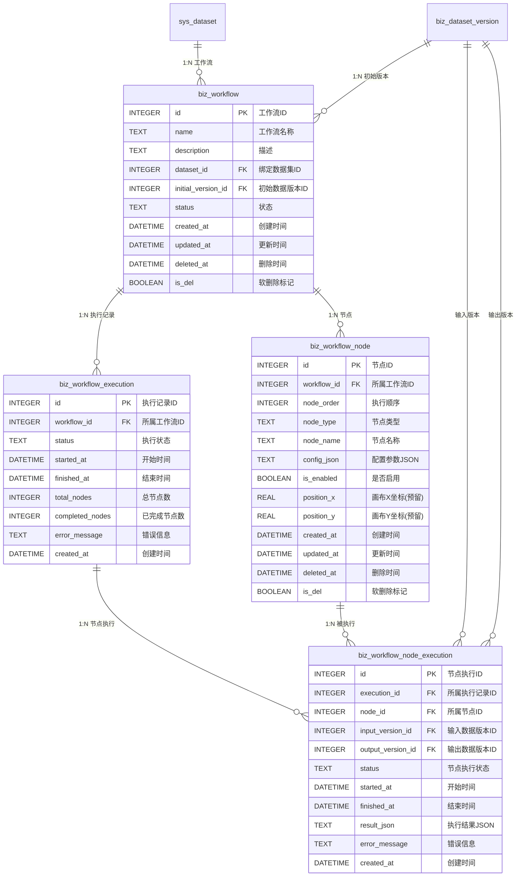

# 自动化工作流数据库设计文档

> **版本**: v1.0  
> **最后更新**: 2026-02-23  
> **目标读者**: 负责数据库表结构实现与维护的开发者

---

## 目录

1. [概述](#1-概述)
2. [ER 图](#2-er-图)
3. [表结构定义](#3-表结构定义)
   - [3.1 工作流定义表 (biz_workflow)](#31-工作流定义表-biz_workflow)
   - [3.2 工作流节点表 (biz_workflow_node)](#32-工作流节点表-biz_workflow_node)
   - [3.3 工作流执行记录表 (biz_workflow_execution)](#33-工作流执行记录表-biz_workflow_execution)
   - [3.4 节点执行详情表 (biz_workflow_node_execution)](#34-节点执行详情表-biz_workflow_node_execution)
4. [索引设计](#4-索引设计)
5. [建表 SQL](#5-建表-sql)
6. [config_json 结构规范](#6-config_json-结构规范)
7. [SQL 操作示例](#7-sql-操作示例)
8. [与现有表的关系](#8-与现有表的关系)

---

## 1. 概述

自动化工作流模块新增 **4 张业务表**，遵循项目现有的命名规范（`biz_` 前缀表示业务数据表）。所有表均包含标准的软删除字段 (`is_del`, `deleted_at`) 和时间戳字段 (`created_at`, `updated_at`)。

| 表名                          | 说明         | 预估数据量         |
| ----------------------------- | ------------ | ------------------ |
| `biz_workflow`                | 工作流定义   | 每个数据集 1-10 个 |
| `biz_workflow_node`           | 工作流节点   | 每个工作流 2-10 个 |
| `biz_workflow_execution`      | 执行记录     | 每个工作流 N 次    |
| `biz_workflow_node_execution` | 节点执行详情 | 每次执行 × 节点数  |

**表命名规范回顾**：

| 前缀    | 含义       | 已有示例                                                             |
| ------- | ---------- | -------------------------------------------------------------------- |
| `sys_`  | 系统基础表 | `sys_category`, `sys_dataset`                                        |
| `conf_` | 配置表     | `conf_column_setting`, `conf_outlier_detection`                      |
| `biz_`  | 业务数据表 | `biz_dataset_version`, `biz_outlier_result`, `biz_imputation_result` |
| `stat_` | 统计数据表 | `stat_version_detail`                                                |

---

## 2. ER 图



---

## 3. 表结构定义

### 3.1 工作流定义表 (`biz_workflow`)

存储用户创建的工作流定义信息。每个工作流绑定到一个数据集，并指定一个初始数据版本作为流水线的起点。

| 字段名               | 类型     | 约束                      | 说明                                       |
| -------------------- | -------- | ------------------------- | ------------------------------------------ |
| `id`                 | INTEGER  | PRIMARY KEY AUTOINCREMENT | 工作流唯一标识                             |
| `name`               | TEXT     | NOT NULL                  | 工作流名称（用户自定义）                   |
| `description`        | TEXT     |                           | 工作流描述                                 |
| `dataset_id`         | INTEGER  | NOT NULL                  | 绑定的数据集 ID → `sys_dataset.id`         |
| `initial_version_id` | INTEGER  | NOT NULL                  | 初始数据版本 ID → `biz_dataset_version.id` |
| `status`             | TEXT     | NOT NULL, DEFAULT 'DRAFT' | 工作流状态                                 |
| `created_at`         | DATETIME | DEFAULT CURRENT_TIMESTAMP | 创建时间                                   |
| `updated_at`         | DATETIME | DEFAULT CURRENT_TIMESTAMP | 更新时间                                   |
| `deleted_at`         | DATETIME |                           | 删除时间                                   |
| `is_del`             | BOOLEAN  | DEFAULT 0                 | 软删除标记 (0=正常, 1=已删除)              |

**`status` 枚举值**：

| 值          | 说明             |
| ----------- | ---------------- |
| `DRAFT`     | 草稿，正在编辑中 |
| `READY`     | 就绪，可以执行   |
| `RUNNING`   | 执行中           |
| `COMPLETED` | 最近一次执行成功 |
| `FAILED`    | 最近一次执行失败 |

### 3.2 工作流节点表 (`biz_workflow_node`)

存储工作流中的节点定义。每个节点有明确的执行顺序 (`node_order`)，节点参数以 JSON 格式存储在 `config_json` 中。

| 字段名        | 类型     | 约束                      | 说明                                             |
| ------------- | -------- | ------------------------- | ------------------------------------------------ |
| `id`          | INTEGER  | PRIMARY KEY AUTOINCREMENT | 节点唯一标识                                     |
| `workflow_id` | INTEGER  | NOT NULL                  | 所属工作流 ID → `biz_workflow.id`                |
| `node_order`  | INTEGER  | NOT NULL                  | 执行顺序（从 1 开始，越小越先执行）              |
| `node_type`   | TEXT     | NOT NULL                  | 节点类型枚举                                     |
| `node_name`   | TEXT     | NOT NULL                  | 节点显示名称（用户自定义）                       |
| `config_json` | TEXT     |                           | 节点配置参数（JSON 格式，结构由 node_type 决定） |
| `is_enabled`  | BOOLEAN  | DEFAULT 1                 | 是否启用 (0=禁用/跳过, 1=启用)                   |
| `position_x`  | REAL     |                           | 画布 X 坐标（预留，当前不使用）                  |
| `position_y`  | REAL     |                           | 画布 Y 坐标（预留，当前不使用）                  |
| `created_at`  | DATETIME | DEFAULT CURRENT_TIMESTAMP | 创建时间                                         |
| `updated_at`  | DATETIME | DEFAULT CURRENT_TIMESTAMP | 更新时间                                         |
| `deleted_at`  | DATETIME |                           | 删除时间                                         |
| `is_del`      | BOOLEAN  | DEFAULT 0                 | 软删除标记                                       |

**`node_type` 枚举值**：

| 值                     | 说明            | 是否产出新版本 |
| ---------------------- | --------------- | -------------- |
| `OUTLIER_DETECTION`    | 异常检测 + 过滤 | 是             |
| `IMPUTATION`           | 缺失值插补      | 是             |
| `FLUX_PARTITIONING`    | 通量分割        | 是             |
| `CORRELATION_ANALYSIS` | 相关性分析      | 否             |
| `EXPORT`               | 数据导出        | 否             |

### 3.3 工作流执行记录表 (`biz_workflow_execution`)

记录每次工作流执行的整体信息，包括状态、时间、进度、错误信息。

| 字段名            | 类型     | 约束                        | 说明                              |
| ----------------- | -------- | --------------------------- | --------------------------------- |
| `id`              | INTEGER  | PRIMARY KEY AUTOINCREMENT   | 执行记录唯一标识                  |
| `workflow_id`     | INTEGER  | NOT NULL                    | 所属工作流 ID → `biz_workflow.id` |
| `status`          | TEXT     | NOT NULL, DEFAULT 'PENDING' | 执行状态                          |
| `started_at`      | DATETIME |                             | 开始时间                          |
| `finished_at`     | DATETIME |                             | 结束时间                          |
| `total_nodes`     | INTEGER  | DEFAULT 0                   | 总节点数（含禁用节点）            |
| `completed_nodes` | INTEGER  | DEFAULT 0                   | 已完成节点数                      |
| `error_message`   | TEXT     |                             | 错误信息（失败时记录）            |
| `created_at`      | DATETIME | DEFAULT CURRENT_TIMESTAMP   | 创建时间                          |

**`status` 枚举值**：

| 值          | 说明                       |
| ----------- | -------------------------- |
| `PENDING`   | 待执行                     |
| `RUNNING`   | 执行中                     |
| `COMPLETED` | 执行成功                   |
| `FAILED`    | 执行失败（在某个节点中断） |
| `CANCELLED` | 用户取消                   |

### 3.4 节点执行详情表 (`biz_workflow_node_execution`)

记录单次执行中每个节点的详细执行信息，包括输入/输出版本、状态、耗时、结果。

| 字段名              | 类型     | 约束                        | 说明                                                         |
| ------------------- | -------- | --------------------------- | ------------------------------------------------------------ |
| `id`                | INTEGER  | PRIMARY KEY AUTOINCREMENT   | 节点执行唯一标识                                             |
| `execution_id`      | INTEGER  | NOT NULL                    | 所属执行记录 ID → `biz_workflow_execution.id`                |
| `node_id`           | INTEGER  | NOT NULL                    | 所属节点 ID → `biz_workflow_node.id`                         |
| `input_version_id`  | INTEGER  |                             | 输入数据版本 ID → `biz_dataset_version.id`                   |
| `output_version_id` | INTEGER  |                             | 输出数据版本 ID → `biz_dataset_version.id`（仅转换节点有值） |
| `status`            | TEXT     | NOT NULL, DEFAULT 'PENDING' | 节点执行状态                                                 |
| `started_at`        | DATETIME |                             | 开始时间                                                     |
| `finished_at`       | DATETIME |                             | 结束时间                                                     |
| `result_json`       | TEXT     |                             | 执行结果摘要（JSON 格式）                                    |
| `error_message`     | TEXT     |                             | 错误信息（失败时记录）                                       |
| `created_at`        | DATETIME | DEFAULT CURRENT_TIMESTAMP   | 创建时间                                                     |

**`status` 枚举值**：

| 值          | 说明                 |
| ----------- | -------------------- |
| `PENDING`   | 待执行               |
| `RUNNING`   | 执行中               |
| `COMPLETED` | 执行成功             |
| `FAILED`    | 执行失败             |
| `SKIPPED`   | 已跳过（节点被禁用） |

**`result_json` 示例**：

```json
{
  "outlierCount": 156,
  "outlierRate": 0.032,
  "filteredColumns": ["Ta_2m", "SW_IN", "CO2_FLUX"],
  "executionTimeMs": 2300
}
```

---

## 4. 索引设计

```sql
-- 工作流表：按数据集查询
CREATE INDEX IF NOT EXISTS idx_workflow_dataset
  ON biz_workflow(dataset_id);

-- 工作流表：按状态查询
CREATE INDEX IF NOT EXISTS idx_workflow_status
  ON biz_workflow(status);

-- 节点表：按工作流 + 执行顺序查询（核心查询路径）
CREATE INDEX IF NOT EXISTS idx_workflow_node_order
  ON biz_workflow_node(workflow_id, node_order);

-- 执行记录表：按工作流查询（查看历史执行）
CREATE INDEX IF NOT EXISTS idx_workflow_execution_workflow
  ON biz_workflow_execution(workflow_id);

-- 执行记录表：按状态查询（查找运行中的执行）
CREATE INDEX IF NOT EXISTS idx_workflow_execution_status
  ON biz_workflow_execution(status);

-- 节点执行详情表：按执行记录查询（获取某次执行的所有节点详情）
CREATE INDEX IF NOT EXISTS idx_workflow_node_execution_exec
  ON biz_workflow_node_execution(execution_id);

-- 节点执行详情表：按节点查询（获取某节点的历史执行记录）
CREATE INDEX IF NOT EXISTS idx_workflow_node_execution_node
  ON biz_workflow_node_execution(node_id);
```

---

## 5. 建表 SQL

以下 SQL 将在 `DatabaseManager.ts` 的新方法 `initWorkflowTables()` 中执行：

```sql
-- ================================================================
-- 5.1 工作流定义表 (biz_workflow)
-- ================================================================
CREATE TABLE IF NOT EXISTS biz_workflow (
  id                  INTEGER PRIMARY KEY AUTOINCREMENT,
  name                TEXT    NOT NULL,
  description         TEXT,
  dataset_id          INTEGER NOT NULL,
  initial_version_id  INTEGER NOT NULL,
  status              TEXT    NOT NULL DEFAULT 'DRAFT'
                        CHECK(status IN ('DRAFT', 'READY', 'RUNNING', 'COMPLETED', 'FAILED')),
  created_at          DATETIME DEFAULT CURRENT_TIMESTAMP,
  updated_at          DATETIME DEFAULT CURRENT_TIMESTAMP,
  deleted_at          DATETIME,
  is_del              BOOLEAN  DEFAULT 0,
  FOREIGN KEY (dataset_id) REFERENCES sys_dataset(id) ON DELETE CASCADE,
  FOREIGN KEY (initial_version_id) REFERENCES biz_dataset_version(id)
);

-- ================================================================
-- 5.2 工作流节点表 (biz_workflow_node)
-- ================================================================
CREATE TABLE IF NOT EXISTS biz_workflow_node (
  id            INTEGER PRIMARY KEY AUTOINCREMENT,
  workflow_id   INTEGER NOT NULL,
  node_order    INTEGER NOT NULL,
  node_type     TEXT    NOT NULL
                  CHECK(node_type IN (
                    'OUTLIER_DETECTION',
                    'IMPUTATION',
                    'FLUX_PARTITIONING',
                    'CORRELATION_ANALYSIS',
                    'EXPORT'
                  )),
  node_name     TEXT    NOT NULL,
  config_json   TEXT,
  is_enabled    BOOLEAN DEFAULT 1,
  position_x    REAL,
  position_y    REAL,
  created_at    DATETIME DEFAULT CURRENT_TIMESTAMP,
  updated_at    DATETIME DEFAULT CURRENT_TIMESTAMP,
  deleted_at    DATETIME,
  is_del        BOOLEAN  DEFAULT 0,
  FOREIGN KEY (workflow_id) REFERENCES biz_workflow(id) ON DELETE CASCADE
);

-- ================================================================
-- 5.3 工作流执行记录表 (biz_workflow_execution)
-- ================================================================
CREATE TABLE IF NOT EXISTS biz_workflow_execution (
  id              INTEGER PRIMARY KEY AUTOINCREMENT,
  workflow_id     INTEGER NOT NULL,
  status          TEXT    NOT NULL DEFAULT 'PENDING'
                    CHECK(status IN ('PENDING', 'RUNNING', 'COMPLETED', 'FAILED', 'CANCELLED')),
  started_at      DATETIME,
  finished_at     DATETIME,
  total_nodes     INTEGER DEFAULT 0,
  completed_nodes INTEGER DEFAULT 0,
  error_message   TEXT,
  created_at      DATETIME DEFAULT CURRENT_TIMESTAMP,
  FOREIGN KEY (workflow_id) REFERENCES biz_workflow(id) ON DELETE CASCADE
);

-- ================================================================
-- 5.4 节点执行详情表 (biz_workflow_node_execution)
-- ================================================================
CREATE TABLE IF NOT EXISTS biz_workflow_node_execution (
  id                INTEGER PRIMARY KEY AUTOINCREMENT,
  execution_id      INTEGER NOT NULL,
  node_id           INTEGER NOT NULL,
  input_version_id  INTEGER,
  output_version_id INTEGER,
  status            TEXT    NOT NULL DEFAULT 'PENDING'
                      CHECK(status IN ('PENDING', 'RUNNING', 'COMPLETED', 'FAILED', 'SKIPPED')),
  started_at        DATETIME,
  finished_at       DATETIME,
  result_json       TEXT,
  error_message     TEXT,
  created_at        DATETIME DEFAULT CURRENT_TIMESTAMP,
  FOREIGN KEY (execution_id) REFERENCES biz_workflow_execution(id) ON DELETE CASCADE,
  FOREIGN KEY (node_id) REFERENCES biz_workflow_node(id),
  FOREIGN KEY (input_version_id) REFERENCES biz_dataset_version(id),
  FOREIGN KEY (output_version_id) REFERENCES biz_dataset_version(id)
);

-- ================================================================
-- 5.5 索引
-- ================================================================
CREATE INDEX IF NOT EXISTS idx_workflow_dataset
  ON biz_workflow(dataset_id);

CREATE INDEX IF NOT EXISTS idx_workflow_status
  ON biz_workflow(status);

CREATE INDEX IF NOT EXISTS idx_workflow_node_order
  ON biz_workflow_node(workflow_id, node_order);

CREATE INDEX IF NOT EXISTS idx_workflow_execution_workflow
  ON biz_workflow_execution(workflow_id);

CREATE INDEX IF NOT EXISTS idx_workflow_execution_status
  ON biz_workflow_execution(status);

CREATE INDEX IF NOT EXISTS idx_workflow_node_execution_exec
  ON biz_workflow_node_execution(execution_id);

CREATE INDEX IF NOT EXISTS idx_workflow_node_execution_node
  ON biz_workflow_node_execution(node_id);
```

---

## 6. config_json 结构规范

`biz_workflow_node.config_json` 字段存储每个节点的配置参数，JSON 结构由 `node_type` 决定。

### 6.1 异常检测节点 (`OUTLIER_DETECTION`)

```json
{
  "detectionMethod": "THRESHOLD_STATIC",
  "targetColumns": null,
  "methodParams": {
    "usePhysicalRange": true
  },
  "autoApply": true
}
```

| 字段              | 类型             | 必填 | 说明                                            |
| ----------------- | ---------------- | ---- | ----------------------------------------------- |
| `detectionMethod` | string           | 是   | 检测方法：`THRESHOLD_STATIC` / `ZSCORE` / `IQR` |
| `targetColumns`   | string[] \| null | 否   | 目标列，null 表示全部数值列                     |
| `methodParams`    | object           | 否   | 方法参数                                        |
| `autoApply`       | boolean          | 否   | 是否自动应用过滤，默认 true                     |

### 6.2 缺失值插补节点 (`IMPUTATION`)

```json
{
  "methodId": "LINEAR",
  "targetColumns": ["Ta_2m", "SW_IN"],
  "methodParams": {},
  "autoApply": true
}
```

| 字段            | 类型             | 必填 | 说明                                                    |
| --------------- | ---------------- | ---- | ------------------------------------------------------- |
| `methodId`      | string           | 是   | 插补方法标识（对应 `conf_imputation_method.method_id`） |
| `targetColumns` | string[] \| null | 否   | 目标列，null 表示全部缺失列                             |
| `methodParams`  | object           | 否   | 方法参数（结构由方法决定）                              |
| `autoApply`     | boolean          | 否   | 是否自动应用到数据集，默认 true                         |

### 6.3 通量分割节点 (`FLUX_PARTITIONING`)

```json
{
  "methodId": "NIGHTTIME_REICHSTEIN",
  "columnMapping": {
    "NEE": "FC",
    "Rg": "SW_IN",
    "Tair": "TA",
    "VPD": "VPD",
    "Ustar": "USTAR"
  },
  "siteInfo": {
    "latitude": 39.99,
    "longitude": 116.19,
    "timezone": 8
  },
  "options": {
    "ustarFiltering": false
  }
}
```

| 字段            | 类型   | 必填 | 说明                                       |
| --------------- | ------ | ---- | ------------------------------------------ |
| `methodId`      | string | 是   | `NIGHTTIME_REICHSTEIN` / `DAYTIME_LASSLOP` |
| `columnMapping` | object | 是   | 列名映射                                   |
| `siteInfo`      | object | 是   | 站点信息                                   |
| `options`       | object | 否   | 附加选项                                   |

### 6.4 相关性分析节点 (`CORRELATION_ANALYSIS`)

```json
{
  "columns": ["Ta_2m", "SW_IN", "CO2_FLUX", "VPD"],
  "method": "pearson"
}
```

| 字段      | 类型     | 必填 | 说明                                         |
| --------- | -------- | ---- | -------------------------------------------- |
| `columns` | string[] | 是   | 参与分析的列名                               |
| `method`  | string   | 是   | 分析方法：`pearson` / `spearman` / `kendall` |

### 6.5 数据导出节点 (`EXPORT`)

```json
{
  "format": "csv",
  "columns": null,
  "fileNameTemplate": "{dataset}_{version}_{date}"
}
```

| 字段               | 类型             | 必填 | 说明                     |
| ------------------ | ---------------- | ---- | ------------------------ |
| `format`           | string           | 是   | 导出格式：`csv` / `xlsx` |
| `columns`          | string[] \| null | 否   | 导出列，null 表示全部    |
| `outputPath`       | string           | 否   | 输出路径，空则弹出选择器 |
| `fileNameTemplate` | string           | 否   | 文件名模板               |

---

## 7. SQL 操作示例

### 7.1 创建工作流

```sql
INSERT INTO biz_workflow (name, description, dataset_id, initial_version_id, status)
VALUES ('标准QC流水线', '异常检测→插补→通量分割→导出', 1, 1, 'DRAFT');
```

### 7.2 添加节点

```sql
-- 节点1: 异常检测
INSERT INTO biz_workflow_node (workflow_id, node_order, node_type, node_name, config_json)
VALUES (1, 1, 'OUTLIER_DETECTION', '阈值过滤',
  '{"detectionMethod":"THRESHOLD_STATIC","targetColumns":null,"methodParams":{"usePhysicalRange":true},"autoApply":true}');

-- 节点2: 缺失值插补
INSERT INTO biz_workflow_node (workflow_id, node_order, node_type, node_name, config_json)
VALUES (1, 2, 'IMPUTATION', 'MDS插补',
  '{"methodId":"MDS_REDDYPROC","targetColumns":null,"methodParams":{},"autoApply":true}');

-- 节点3: 通量分割
INSERT INTO biz_workflow_node (workflow_id, node_order, node_type, node_name, config_json)
VALUES (1, 3, 'FLUX_PARTITIONING', '夜间法分割',
  '{"methodId":"NIGHTTIME_REICHSTEIN","columnMapping":{"NEE":"FC","Rg":"SW_IN","Tair":"TA","VPD":"VPD"},"siteInfo":{"latitude":39.99,"longitude":116.19,"timezone":8}}');

-- 节点4: 数据导出
INSERT INTO biz_workflow_node (workflow_id, node_order, node_type, node_name, config_json)
VALUES (1, 4, 'EXPORT', '导出CSV',
  '{"format":"csv","columns":null}');
```

### 7.3 查询工作流及其节点

```sql
SELECT
  w.id AS workflow_id,
  w.name AS workflow_name,
  w.status,
  n.node_order,
  n.node_type,
  n.node_name,
  n.is_enabled
FROM biz_workflow w
JOIN biz_workflow_node n ON w.id = n.workflow_id
WHERE w.dataset_id = 1
  AND w.is_del = 0
  AND n.is_del = 0
ORDER BY w.id, n.node_order;
```

### 7.4 创建执行记录并记录节点执行

```sql
-- 创建执行记录
INSERT INTO biz_workflow_execution (workflow_id, status, started_at, total_nodes)
VALUES (1, 'RUNNING', datetime('now'), 4);

-- 记录第一个节点开始执行
INSERT INTO biz_workflow_node_execution (execution_id, node_id, input_version_id, status, started_at)
VALUES (1, 1, 1, 'RUNNING', datetime('now'));

-- 第一个节点执行完成
UPDATE biz_workflow_node_execution
SET status = 'COMPLETED',
    output_version_id = 2,
    finished_at = datetime('now'),
    result_json = '{"outlierCount":156,"outlierRate":0.032,"executionTimeMs":2300}'
WHERE id = 1;

-- 更新执行进度
UPDATE biz_workflow_execution
SET completed_nodes = 1
WHERE id = 1;
```

### 7.5 查询执行历史及节点详情

```sql
SELECT
  e.id AS execution_id,
  e.status AS execution_status,
  e.started_at,
  e.finished_at,
  e.completed_nodes || '/' || e.total_nodes AS progress,
  ne.node_id,
  n.node_name,
  n.node_type,
  ne.status AS node_status,
  ne.input_version_id,
  ne.output_version_id,
  ne.error_message
FROM biz_workflow_execution e
JOIN biz_workflow_node_execution ne ON e.id = ne.execution_id
JOIN biz_workflow_node n ON ne.node_id = n.id
WHERE e.workflow_id = 1
ORDER BY e.created_at DESC, n.node_order ASC;
```

### 7.6 重排节点顺序

```sql
-- 将节点 ID=3 移动到第一位，其余顺延
UPDATE biz_workflow_node SET node_order = 1 WHERE id = 3;
UPDATE biz_workflow_node SET node_order = 2 WHERE id = 1;
UPDATE biz_workflow_node SET node_order = 3 WHERE id = 2;
UPDATE biz_workflow_node SET node_order = 4 WHERE id = 4;
```

---

## 8. 与现有表的关系

### 8.1 外键关联图

```
sys_dataset
  ├── biz_workflow.dataset_id ──────────────┐
  │                                         │
biz_dataset_version                         │
  ├── biz_workflow.initial_version_id ──────┤ biz_workflow
  ├── biz_workflow_node_execution.input_version_id    │
  └── biz_workflow_node_execution.output_version_id   │
                                            │
                                   biz_workflow_node
                                            │
                                   biz_workflow_execution
                                            │
                                   biz_workflow_node_execution
```

### 8.2 与现有业务结果表的关系

工作流执行过程中，每个节点调用对应的 Service 方法，会在**已有的业务结果表**中产生记录：

| 节点类型               | 产生记录的现有表                                                               |
| ---------------------- | ------------------------------------------------------------------------------ |
| `OUTLIER_DETECTION`    | `biz_outlier_result`, `biz_outlier_detail`, `biz_outlier_column_stat`          |
| `IMPUTATION`           | `biz_imputation_result`, `biz_imputation_detail`, `biz_imputation_column_stat` |
| `FLUX_PARTITIONING`    | `biz_flux_partitioning_result`                                                 |
| `CORRELATION_ANALYSIS` | `biz_correlation_result`                                                       |
| `EXPORT`               | 无（直接写入文件系统）                                                         |

`biz_workflow_node_execution.result_json` 中可存储对应业务结果表的 ID，便于后续追溯：

```json
{
  "businessResultId": 15,
  "businessResultTable": "biz_outlier_result",
  "executionTimeMs": 2300
}
```

### 8.3 DatabaseManager 集成点

在 `electron/core/DatabaseManager.ts` 的 `initSchema()` 方法中新增调用：

```typescript
private initSchema(): void {
  if (!this.db) return;

  this.initCoreTables();
  this.initSystemSettingsTables();
  this.initOutlierDetectionTables();
  this.initCorrelationAnalysisTables();
  this.initImputationTables();
  this.initFluxPartitioningTables();
  this.initWorkflowTables();        // ← 新增
  this.migrateSchema();
}
```
